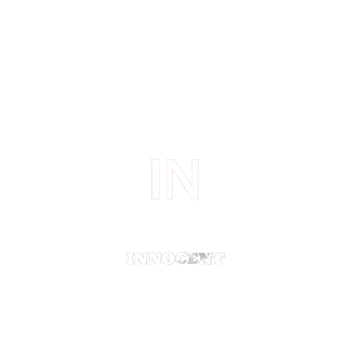

<a name="readme-top"></a>

<div align="center">
  
  <br/>
</div>

<div align="center">

  <h1><b>School Library</b></h1>

</div>
<!-- TABLE OF CONTENTS -->

# 📗 Table of Contents

- [📖 About the Project](#about-project)
  - [🛠 Built With](#built-with)
    - [Tech Stack](#tech-stack)
    - [Key Features](#key-features)
- [💻 Getting Started](#getting-started)
  - [Setup](#setup)
  - [Prerequisites](#prerequisites)
  - [Install](#install)
  - [Usage](#usage)
- [👥 Authors](#authors)
- [🔭 Future Features](#future-features)
- [🤝 Contributing](#contributing)
- [⭐️ Show your support](#support)
- [🙏 Acknowledgements](#acknowledgements)
- [📝 License](#license)

<!-- PROJECT DESCRIPTION -->

# 📖 [School Library] <a name="about-project"></a>
School Library is an OOP app that uses classes to represents students and teachers.

## 🛠 Built With <a name="built-with"></a>
<li>Ruby</li>
<li>Github</li>
<li>GitFlow</li>

### Tech Stack <a name="tech-stack"></a>
<details>
<summary>Ruby</summary>
  <ul>
    <li><a href="https://www.ruby.org/">Ruby</a></li>
  </ul>
</details>

<!-- Features -->

### Key Features <a name="key-features"></a>

- [ ] **Created Person class**
- [ ] **Created Student class**
- [ ] **Created Teacher class**
- [ ] **[Use the Decorator design pattern]**


<p align="right">(<a href="#readme-top">back to top</a>)</p>


<!-- GETTING STARTED -->

## Getting Started

### Prerequisites

In order to use this application you are required to have an IDE like VS Code and Ruby installed in your machine

### Setup

Create any folder in your local environment

```sh
  run git clone https://github.com/Innocent259/School-library
  run cd School-library
```

### Install

Install this project dependencies by running

```sh
  run bundle install
```

### Usage

To run the project, execute the following command:

```sh
  run ruby person.rb
```

<!-- AUTHORS -->

## 👥 Authors <a name="authors"></a>

👤 **Innocent Ndahimana**

- GitHub: [@innocent259](https://github.com/Innocent259)
- Twitter: [@innocentndahimana](https://www.linkedin.com/in/innocent259/)
- LinkedIn: [@innocentndahimana](https://twitter.com/ndahimana259)


<p align="right">(<a href="#readme-top">back to top</a>)</p>

<!-- FUTURE FEATURES -->

## 🔭 Future Features <a name="future-features"></a>

- [ ] **[Set up associations]**
- [ ] **[Add basic UI]**
- [ ] **[Refactor code]**
- [ ] **[Preserve data]**
- [ ] **[Unit test]**

<p align="right">(<a href="#readme-top">back to top</a>)</p>

<!-- CONTRIBUTING -->

## 🤝 Contributing <a name="contributing"></a>

Contributions, issues, and feature requests are welcome!

Feel free to check the [issues page](https://github.com/Innocent259/Vet-clinic/issues).

<p align="right">(<a href="#readme-top">back to top</a>)</p>

<!-- SUPPORT -->

## ⭐️ Show your support <a name="support"></a>

> If you like this project consider giving it a ⭐️

<p align="right">(<a href="#readme-top">back to top</a>)</p>

<!-- ACKNOWLEDGEMENTS -->

## 🙏 Acknowledgments <a name="acknowledgements"></a>

I would like to thank Microverse for the outstanding collection of information they have provided that enabled me to create the project. 

<p align="right">(<a href="#readme-top">back to top</a>)</p>

<!-- LICENSE -->

## 📝 License <a name="license"></a>

This project is [MIT](./LICENSE) licensed.

<p align="right">(<a href="#readme-top">back to top</a>)</p>